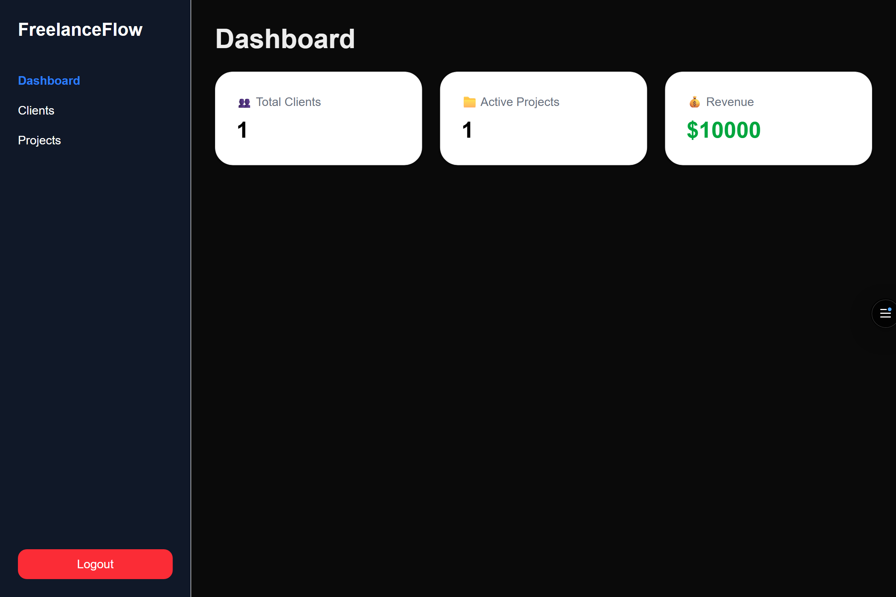
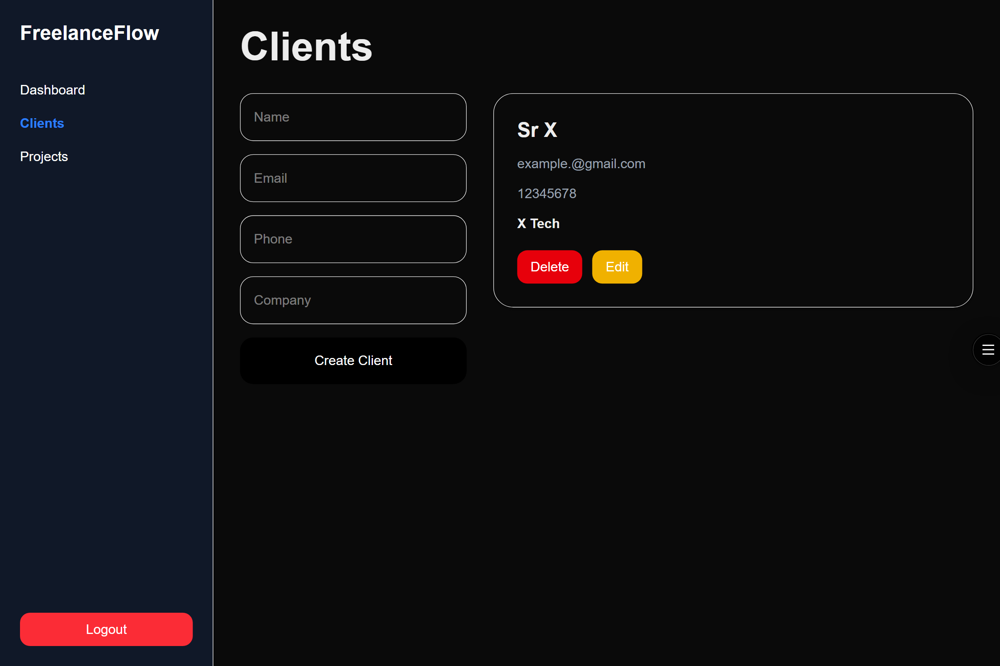
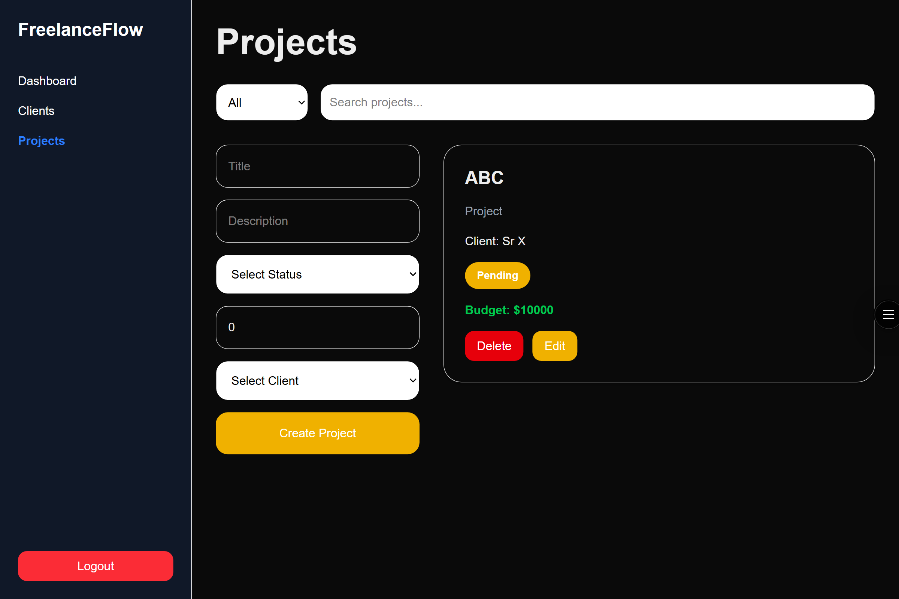

# FreelanceFlow

**A full stack CRM for freelancers** — manage clients, projects, and revenue in one place.

**Un CRM full stack para freelancers** — gestioná clientes, proyectos e ingresos desde un solo lugar.

### Preview





🌐 **Live Demo:** [freelance-flow-alpha.vercel.app](https://freelance-flow-alpha.vercel.app/)  
📦 **Repo:** [github.com/Zonxv2/FreelanceFlow](https://github.com/Zonxv2/FreelanceFlow)

---

## 🇬🇧 English

### About

FreelanceFlow is a full stack web application built to help freelancers manage their work. Users can register, log in, create clients and projects, filter by status, and track total revenue — all with data persisted in the cloud and protected by JWT authentication.

### Features

- User registration and login with JWT authentication
- Protected routes — unauthenticated users are redirected to login
- Full CRUD for clients (create, read, update, delete)
- Full CRUD for projects with status filtering and search
- Revenue tracking on the dashboard
- Toast notifications for all user actions
- Responsive design for mobile, tablet, and desktop
- Centralized API service with automatic token injection via Axios interceptors

### Tech Stack

**Frontend**
- Next.js 15 (App Router)
- React 19
- TypeScript
- Tailwind CSS
- Axios

**Backend**
- Node.js + Express
- TypeScript
- MongoDB + Mongoose
- JWT (jsonwebtoken)
- bcrypt

**DevOps**
- Frontend deployed on Vercel
- Backend deployed on Render
- Database on MongoDB Atlas
- Environment variables for production/development separation

### What I learned building this

- Implementing JWT authentication end-to-end (register, login, protected routes)
- Connecting a Next.js frontend to a separate Express backend across different deployments
- Debugging production issues: environment variables, port conflicts, CORS, Render cold starts
- Understanding the difference between local and production environments
- Using Axios interceptors to centralize auth headers
- Managing state and async requests in React
- Deploying separate services (Vercel + Render + MongoDB Atlas)

### Getting Started

```bash
# Clone the repo
git clone https://github.com/Zonxv2/FreelanceFlow.git

# Backend
cd backend
npm install
# Create .env with MONGO_URI, JWT_SECRET, PORT
npm run dev

# Frontend
cd frontend
npm install
# Create .env.local with NEXT_PUBLIC_API_URL=http://localhost:3000/api
npm run dev
```

---

## 🇪🇸 Español

### Sobre el proyecto

FreelanceFlow es una aplicación web full stack construida para que los freelancers gestionen su trabajo. Los usuarios pueden registrarse, iniciar sesión, crear clientes y proyectos, filtrar por estado y hacer seguimiento de sus ingresos — todo con datos persistidos en la nube y protegidos por autenticación JWT.

### Funcionalidades

- Registro e inicio de sesión con autenticación JWT
- Rutas protegidas — los usuarios no autenticados son redirigidos al login
- CRUD completo de clientes (crear, leer, actualizar, eliminar)
- CRUD completo de proyectos con filtro por estado y búsqueda
- Seguimiento de ingresos en el dashboard
- Notificaciones toast para todas las acciones del usuario
- Diseño responsive para mobile, tablet y desktop
- Servicio de API centralizado con inyección automática de token via interceptores de Axios

### Stack tecnológico

**Frontend**
- Next.js 15 (App Router)
- React 19
- TypeScript
- Tailwind CSS
- Axios

**Backend**
- Node.js + Express
- TypeScript
- MongoDB + Mongoose
- JWT (jsonwebtoken)
- bcrypt

**DevOps**
- Frontend deployado en Vercel
- Backend deployado en Render
- Base de datos en MongoDB Atlas
- Variables de entorno para separación producción/desarrollo

### Lo que aprendí construyendo esto

- Implementar autenticación JWT de punta a punta (registro, login, rutas protegidas)
- Conectar un frontend Next.js a un backend Express separado en distintos deployments
- Debuggear problemas de producción: variables de entorno, conflicto de puertos, CORS, cold starts de Render
- Entender la diferencia entre entorno local y producción
- Usar interceptores de Axios para centralizar los headers de autenticación
- Manejar estado y requests asíncronos en React
- Deployar servicios separados (Vercel + Render + MongoDB Atlas)

### Cómo correrlo localmente

```bash
# Clonar el repositorio
git clone https://github.com/Zonxv2/FreelanceFlow.git

# Backend
cd backend
npm install
# Crear .env con MONGO_URI, JWT_SECRET, PORT
npm run dev

# Frontend
cd frontend
npm install
# Crear .env.local con NEXT_PUBLIC_API_URL=http://localhost:3000/api
npm run dev
```

---

## 👤 Author / Autor

**Matías García**  
Junior Full Stack Developer

🔗 [LinkedIn](https://www.linkedin.com/in/matias1garcia2/)  
🐙 [GitHub](https://github.com/Zonxv2)  
📧 matias1garcia2@gmail.com